# 🤖 Agentic Flow


<div align="center">

[](https://nextjs.org/)
[](https://react.dev/)
[](https://www.typescriptlang.org/)
[](https://tailwindcss.com/)
[](https://opensource.org/licenses/MIT)

**An advanced terminal interface for orchestrating specialized AI agents in a structured pipeline.**

[Features](#-key-features) • [Installation](#-quick-start) • [Usage](#-usage) • [Architecture](#-architecture) • [Contributing](#-contributing)

</div>

---

## 📖 Overview

**Agentic Flow** (AgencyOS) is a terminal-based workspace designed for **AI Engineers** and **Developers**. It reimagines the AI development experience by orchestrating specialized agents through a rigorous, linear-inspired pipeline: **Plan**, **Build**, **Review**, and **Deploy**.

The interface mimics a high-performance terminal, providing low-latency interaction, real-time metrics, and a transparent view of the agentic thought process.

## 🚀 Key Features

| Feature | Description |
| :--- | :--- |
| **⚡ Terminal Interface** | A responsive, command-line style interface for interacting with the system shell and agent runtime. |
| **🤖 Role-Based Agents** | Specialized agents collaborate to solve complex tasks: <br> • **Architect** (Plan): Designs system architecture. <br> • **Engineer** (Build): Implements code. <br> • **Critic** (Review): Audits for security & best practices. <br> • **Deployer** (Deploy): Manages infrastructure. |
| **🌊 Structured Pipeline** | Enforces a deterministic workflow (Plan → Build → Review → Deploy) to ensure code quality and stability. |
| **📊 Live Metrics** | Real-time dashboards tracking token usage, phase duration, success rates, and system health. |
| **📋 Visual Plans** | Interactive execution plans that visualize tasks, subtasks, and progress in real-time. |

## 🛠️ Tech Stack

- **Framework**: [Next.js 16.1.1](https://nextjs.org/) (App Router)
- **UI Library**: [React 19.2.3](https://react.dev/)
- **Styling**: [Tailwind CSS v4](https://tailwindcss.com/)
- **State Management**: React Context & Reducers (Native)
- **Icons**: [Lucide React](https://lucide.dev/)

## ⚡ Quick Start

Get the agentic workflow up and running in minutes.

### Prerequisites

- Node.js 20+
- npm

### Installation

1.  **Clone the repository**
    ```bash
    git clone https://github.com/your-username/agentic-flow.git
    cd agentic-flow
    ```

2.  **Install dependencies**
    ```bash
    npm install
    ```

3.  **Start the development server**
    ```bash
    npm run dev
    ```

4.  **Access the terminal**
    Open your browser and navigate to:
    ```
    http://localhost:3000
    ```

## 🖥️ Usage

The Agentic Flow interface is divided into three primary zones:

1.  **Mission Control (Left)**: View the current execution plan and active todos.
2.  **Terminal (Center)**: The primary interaction hub. Type commands or prompts for the agents here.
3.  **Inspector (Right)**: View active file diffs, agent thought chains, and system artifacts.

### Example Commands

- `start build` - Initiates the planning phase with the Architect agent.
- `run tests` - Triggers the Engineer agent to execute the test suite.
- `deploy production` - Hands off the current artifact to the Deployer.


## 🏗️ Architecture

Agentic Flow utilizes a **Role-Based State Machine** to manage the lifecycle of a task. The `TerminalLayout` acts as the orchestrator, routing intents to the appropriate agent based on the current phase.

```mermaid
graph TD
    User[User Input] -->|Command| Terminal[Terminal Layout]
    Terminal -->|Intent| Router{Agent Router}

    Router -->|Plan Phase| Architect[🟦 Architect Agent]
    Router -->|Build Phase| Engineer[🟩 Engineer Agent]
    Router -->|Review Phase| Critic[🟨 Critic Agent]
    Router -->|Deploy Phase| Deployer[🟪 Deployer Agent]

    Architect -->|Blueprint| State[Global State]
    Engineer -->|Code| State
    Critic -->|Feedback| State
    Deployer -->|Release| State
```



## 🤝 Contributing

We welcome contributions from the community!

1.  Fork the project.
2.  Create your feature branch (`git checkout -b feature/AmazingFeature`).
3.  Commit your changes (`git commit -m 'Add some AmazingFeature'`).
4.  Push to the branch (`git push origin feature/AmazingFeature`).
5.  Open a Pull Request.

## 📄 License

Distributed under the MIT License. See `LICENSE` for more information.
